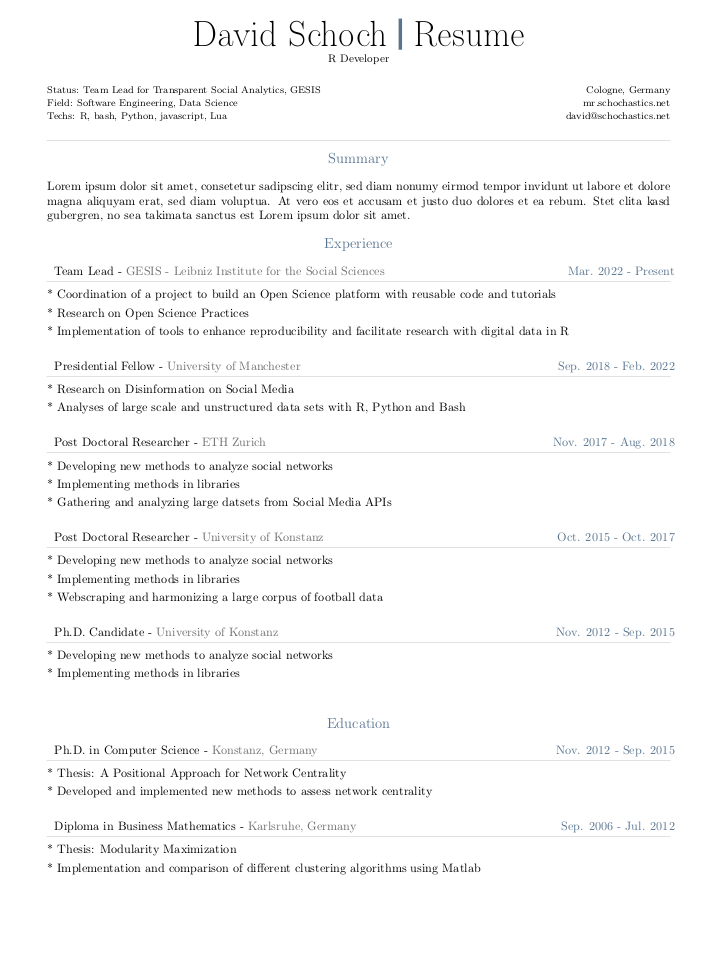
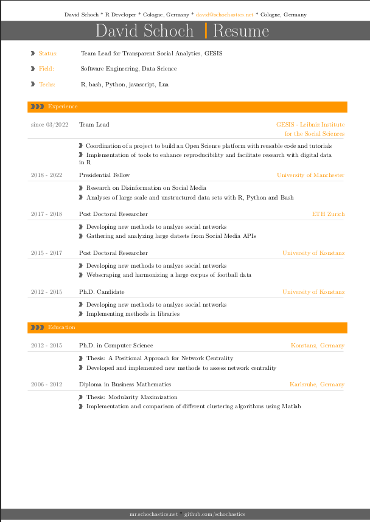
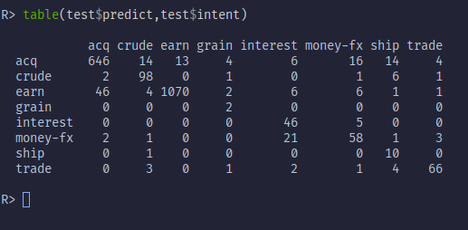

# quarto-cv
A collection of templates to create CVs/Resumes with Quarto.  
Most templates were adopted from these [LaTeX templates for CVs and resumes](https://github.com/jankapunkt/latexcv).

## classic-cv

  
[repository](https://github.com/schochastics/classic-cv)  
```bash
quarto use template schochastics/classic-cv
```
## modern-cv

  
[repository](https://github.com/schochastics/modern-cv)  
```bash
quarto use template schochastics/modern-cv
```

## sidebar-cv

  
[repository](https://github.com/schochastics/sidebar-cv)  
```bash
quarto use template schochastics/sidebar-cv
```


